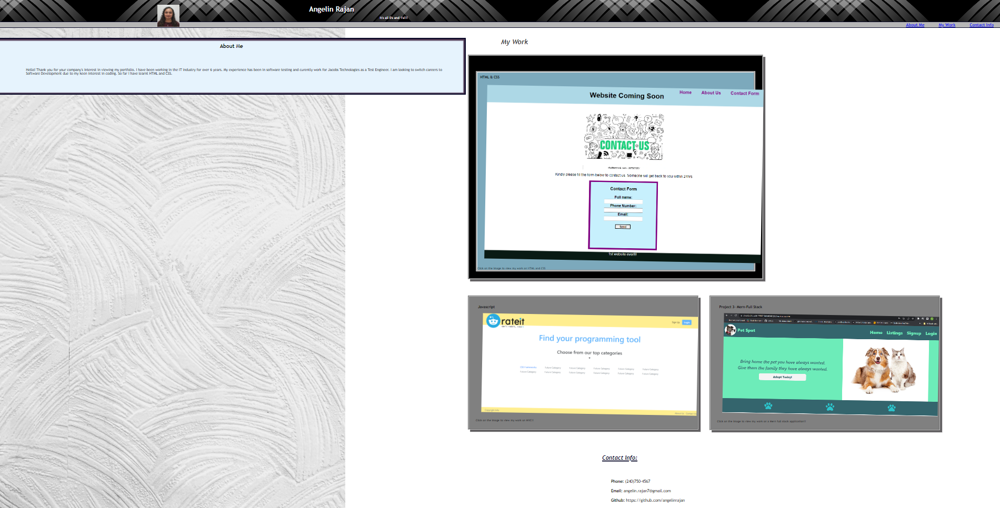

# Angelin's Professional Portfolio

## Website Overview
    The web application named Angelin's Portfolio is my personal professional website to display my portfolio to future employers. The goal for this website is to showcase my work at a single place as I advance through the bootcamp and create additional websites.
    As of now, my website for HTML&CSS has been liked within the Angelin's Portfolio website.
    Key benefit for this webside is for me to present my skills I have learnt to potential employers that is viewable tin different screen sizes.

## Website's Live URL - https://angelinrajan.github.io/Angelin_Professional_Website/

## Functionality within the website-
1. A small picture of me will be displayed
2. Details on "About me", "My work", and "Contact information" will be displayed
3. Clicking on the links displayed within the nav bar will navigate user its corresponding section within the webpage
4. Hovering over the individual sections within "my work" will change background colors to notify user of the selection
5. "HTML & CSS" section within "my work" displays a screenshot of the linked website for the user while Javascript and web API sections display Placeholder images.
6. Clicking on the "HTML & CSS" image navigates the ser to the linked website.
7. Clicking on the placeholder images for Javascript and Web API does not navigate user outside of the webpage yet. This functionality is to change in the future once websites are developed and linked.
8. My photo, and header bckgound image will be viewable in screen sizes 993 or larger.
9. Color changes within header and footer is viewed upon changing different screen sizes.
10. Details on "About me", "My work", and "Contact information" will be displayed clearly for different screen sizes.

## Deployment steps-
1. Created a new repository within Github (included README file)
2. Copied the ssh url for cloning
3. Performed a git clone command followed by the copied ssh url in my local (VS code)
4. Multiple commits and git push was done to keep repository up to date
5. Finally, deployment happened from Github by nativating to the repository/settings/pages and selecting main branch to deploy
6. The progress and the live website's url is displayed within the Actions tab
7. Clicking on the live website's link navigates user to the live website which is deployed without errors (See screenshot below)

    

## Outside source reference-

    1. To learn about using Shadow: https://www.youtube.com/watch?v=y99TgIsKM9Q
    2. To learn how to usean image in same line as header: https://stackoverflow.com/questions/11701311/logo-image-and-h1-heading-on-the-same-line
    3. Referenced for how to use flex properties: https://www.freecodecamp.org/news/flexbox-the-ultimate-css-flex-cheatsheet/
    4. To learn on how to use backgroundImage: https://unsplash.com/s/photos/pattern
    5. To learn about using box-shadown (inner) : https://css-tricks.com/snippets/css/css-box-shadow/
    6. Referenced how to incorporate Jump Anchors : https://www.w3docs.com/snippets/html/how-to-create-an-anchor-link-to-jump-to-a-specific-part-of-a-page.html
